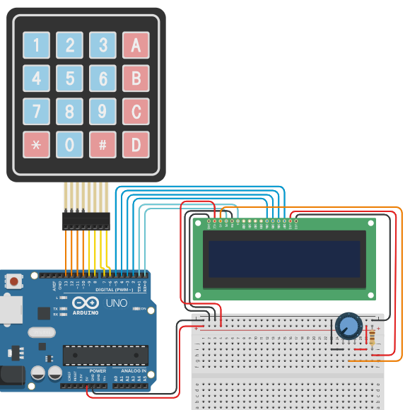

# Introdução

Este projeto foi realizado por alunos da Universidade Tecnológica Federal do Paraná (UTFPR)

## Equipe

Alunos de Engenharia da Computação:

|Nome| gitlab user|
|---|---|
|Diogo Borges Rodrigues| [@dihbgs](https://gitlab.com/dihbgs)|
|Gabriela Dopfer Ricardi| [@Gabi-Dopfer-R](https://gitlab.com/Gabi-Dopfer-R)|

# Documentação

A documentação do projeto pode ser encontrada [neste link](https://dihbgs.gitlab.io/ie21cp20201)

# Links Úteis

* [Tinkercad](https://www.tinkercad.com/)
* [Documentação do Arduino](https://www.arduino.cc/reference/en/)
* [Sintax Markdown](https://docs.gitlab.com/ee/user/markdown.html)
* [Hugo Website](https://gohugo.io/)
