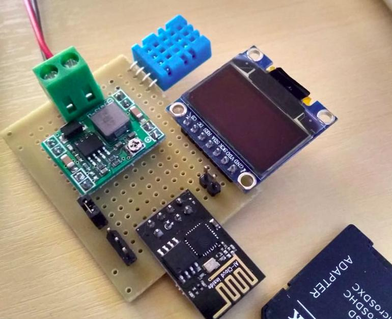
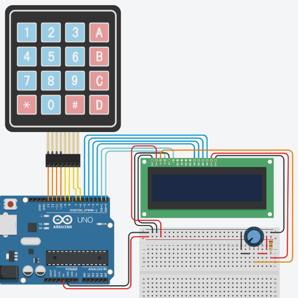

# Documentação de Projeto de Controle de Temperatura

## 1. Introdução

A implementação do projeto pode ser vista pela foto abaixo:




## 2. Objetivos

## 3. Materiais utilizados

### Lista de Materiais
 * Sensor DHT11
 * ESP8266
 * Regulador de Tensão
 * ...

## 4. Esquema Elétrico


O esquema elétrico pode ser visto por:



## 5. Código

```Cpp
void setup(){
}

void loop(){
}
```

## 6. Resultados

O vídeo de demonstração pode ser visto em:



## 7. Desafios encontrados

Sincronizar o servidor de horários.
