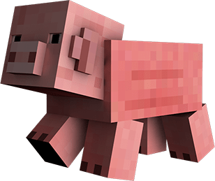

* Este projeto consiste em um cofrinho de moedas e cédulas. O mesmo utiliza um teclado eletrônico como meio de contabilizar o dinheiro inserido.
    * O objeto é semelhante ao porco do jogo "Minecraft" apresentado abaixo.

